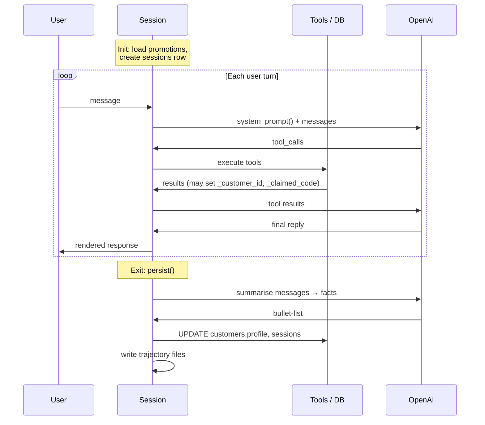
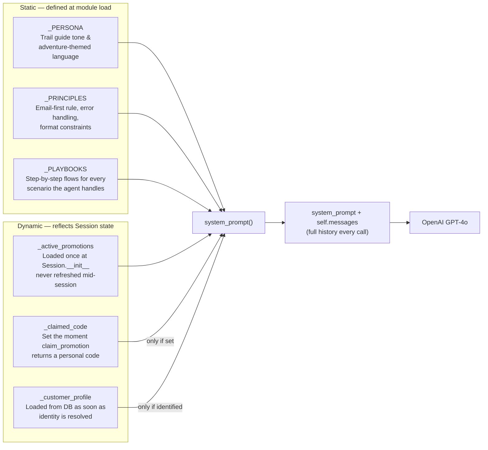

# Sierra Outfitters

AI-powered CLI for an outdoor gear storefront. Customers chat with a GPT-4o-backed agent that handles order lookup, product search, purchasing, and time-gated promotions. All state lives in a local SQLite database.

## Architecture

```
agent.py      — CLI entrypoint + Session class (drives the tool-use loop)
tools.py      — Tool base class, all 8 tool implementations, Registry
db.py         — Schema definition and SQLite connection factory
loader.py     — Seeds sierra.db from JSON files in data/
helpers/      — Reporting utilities (trajectory → markdown)
data/         — Source JSON for products, orders, and promotions
trajectories/ — Per-session conversation logs (raw JSON + rendered markdown)
```

**Tool pattern:** every tool is a class with `name`, `description`, `parameters` (JSON Schema), and `execute()`. `Registry` wraps them and produces the OpenAI function-calling schema. Adding a new tool means subclassing `Tool` and registering it in `build_registry()` — no changes needed elsewhere.

**Database:** SQLite with FK enforcement. Promotions support an optional daily time window (`daily_start_hour` / `daily_end_hour`, Pacific Time). `get_active_promotions` returns all date-valid promotions and includes the window in a `daily_window_pt` field so the agent is aware of it. `claim_promotion` enforces the window and returns an error outside it — the agent relays that to the customer.

---

## Agent Harness & State Management

The agent is built around a `Session` object that owns all in-memory state for one conversation. The diagrams below show how that state is initialised, mutated during the turn loop, and finally flushed to the database on exit.

### Session lifecycle



**Key behaviours:**
- `self.messages` is append-only — every LLM call receives the **full conversation history**, no mid-session summarisation.
- `system_prompt()` is **rebuilt on every LLM call** so it always reflects the latest state (`_claimed_code`, `_customer_profile`).
- Identity resolution is **lazy and post-tool**: `identify()` fires after any tool call that returns a `customer_email`, so `register_customer` is committed before the session reads it back.
- `persist()` makes **two additional LLM calls** — summarise then merge — keeping profile updates out of the live conversation context.

---

### What feeds each LLM call — system_prompt() composition

Every call to OpenAI receives `[system_prompt()] + self.messages`. The system prompt is assembled from static text and live session state:



**Why promotions are fetched eagerly (not on-demand):** if `get_active_promotions` were a tool the LLM could optionally call, there's no guarantee it would do so on the first turn. Loading them at `Session.__init__` and embedding them directly in the system prompt means the agent reliably mentions them in its opening message without an extra round-trip.

---

## Tools

| Tool | Description |
|---|---|
| `lookup_customer` | Load a customer account by email. Always called first when an email is provided. |
| `register_customer` | Create a new account. Only called after `lookup_customer` confirms the email is unknown and the customer provides their full name. |
| `get_orders_by_customer` | List all orders for a customer email. |
| `get_order` | Fetch a specific order by ID, verified against the customer's email. |
| `search_products` | Search in-stock products, optionally filtered by activity tags. |
| `get_active_promotions` | Return all date-valid promotions, including their daily time windows if applicable. |
| `claim_promotion` | Issue a unique personal discount code. Idempotent — returns the same code if already claimed. Enforces daily time windows. |
| `create_order` | Place an order. Validates SKUs, stock, and promo code ownership before writing anything. |

## Setup

```bash
pip install -r requirements.txt

# Add your OpenAI API key to .env:
echo "OPENAI_API_KEY=sk-..." > .env

python agent.py seed   # load data/ into sierra.db (run once)
```

## CLI

```bash
python agent.py                          # start a chat session (default)
python agent.py chat                     # same
python agent.py chat --pt-hour 9        # override PT hour for testing time-gated promos
python agent.py chat --debug-trajectory  # write full LLM prompts into trajectory files
python agent.py seed                     # clear and re-seed sierra.db from data/
python agent.py clear                    # wipe all data, keep schema (prompts for confirmation)
python agent.py clear --yes              # skip confirmation
python agent.py debug_email <email>      # inspect a customer's profile, orders (incl. promo codes used), and session history
```

Trajectory files are written to `trajectories/` after every session — one raw JSON and one rendered markdown per session.

## Testing

Two suites, both driven by pytest:

**Unit tests** (`tests/unittests/`) hit an in-memory SQLite DB — no network, no API calls. Fast and deterministic.

```bash
pytest tests/unittests/
```

**Integration evals** (`tests/integration/`) run full conversations against the real OpenAI API. Six domains, each with weighted test cases — critical correctness and security checks carry higher weights. After each run, pytest prints a scorecard and writes per-test markdown reports to `tests/integration/reports/`.

```bash
pytest tests/integration/                      # run evals
pytest tests/integration/ --save-trajectories  # also save full conversation JSON per test
pytest tests/                                  # run everything
```

Current results: **57/57 tests passing, 46/46 weighted score (100%).**

| Domain | Tests | Weighted Score |
|---|---|---|
| Auth | 4/4 | 10/10 |
| Order Lookup | 4/4 | 7/7 |
| Order Placement | 5/5 | 12/12 |
| Product Search | 4/4 | 6/6 |
| Promotion Claims | 4/4 | 6/6 |
| Promotions | 3/3 | 5/5 |

Each integration test gets a fresh DB via the `seeded_db` fixture (clear + reseed + deterministic test fixtures). The `tracer` fixture wraps `Registry.execute` to record every tool call without changing behavior, and the `trajectory` fixture captures the full conversation for the markdown report.
